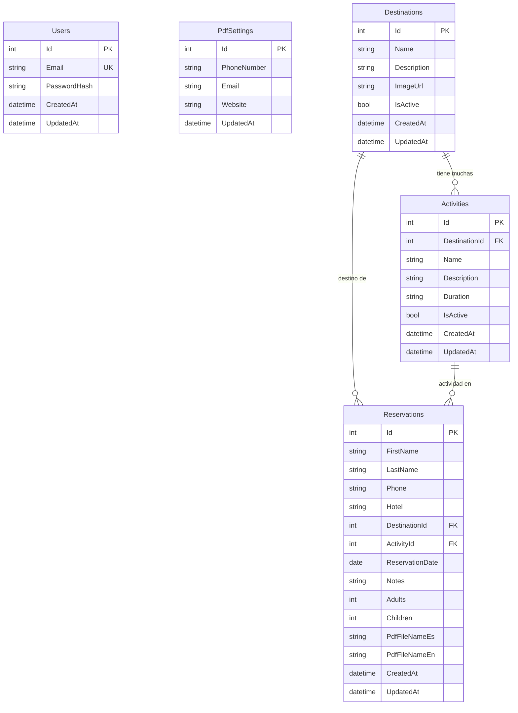

# 🌴 GregroyTours — Plataforma Generadora de Reservas (PDF)

Plataforma fullstack para registrar reservas turísticas, gestionar destinos y actividades, y generar vouchers PDF descargables en **español e inglés**. Stack: **Angular 18+ (Material) / ASP.NET Core 8 / MySQL 8 / Docker**.

---

## Decisiones Confirmadas

| Decisión | Respuesta |
|---|---|
| Componente UI | **Angular Material** (mantenido por Google, integración nativa con Angular) |
| Usuarios | **Un solo usuario admin** |
| Logo | Sin logo por ahora (texto "GREGROYTOURS.COM" como header) |
| Precio en PDF | **No** |
| Estados de reserva | **No** — se gestionan con CRUD directo |
| QR en PDF | **No** |
| Hora en reserva | **No** — solo fecha |
| Servicios incluidos | **No** — se quitan del PDF |
| Idioma del PDF | **Español e Inglés** (seleccionable al generar) |
| Vista "Datos PDF" | **Sí** — para configurar teléfono, correo y web que aparecen al pie del PDF |

---

## Diagrama Entidad-Relación (DER) — Actualizado



### Tablas

| Tabla | Descripción | Campos clave |
|---|---|---|
| **Users** | Admin único del sistema | Email, PasswordHash |
| **PdfSettings** | Datos de contacto que aparecen al pie del PDF | PhoneNumber, Email, Website |
| **Destinations** | Catálogo de destinos turísticos | Name, Description, IsActive |
| **Activities** | Actividades/tours enlazadas a un destino | Name, DestinationId (FK), Duration |
| **Reservations** | Reservas registradas | Datos del pasajero, destino, actividad, fecha, pasajeros, rutas de PDFs |

### Relaciones

| Relación | Tipo |
|---|---|
| `Destinations` → `Activities` | 1:N |
| `Destinations` → `Reservations` | 1:N |
| `Activities` → `Reservations` | 1:N |
| `Users` | Independiente (admin único) |
| `PdfSettings` | Independiente (registro único de configuración) |

---

## Vistas de la Aplicación

### 1. 🔐 Login
- Email + contraseña
- Link "Olvidé mi contraseña" → envía token por correo

### 2. 📊 Dashboard / Inicio
- Resumen rápido: total reservas, destinos activos, actividades
- Accesos directos a las secciones

### 3. 🌍 Destinos (CRUD)
- Tabla con listado de destinos
- Botón agregar/editar/eliminar
- Campos: Nombre, Descripción, Imagen (URL), Activo (toggle)

### 4. 🎯 Actividades (CRUD)
- Tabla con listado de actividades
- Filtro por destino
- Campos: Nombre, Descripción, Duración, Destino (select), Activo (toggle)

### 5. 📝 Nueva Reserva (Formulario)
- **Nombre(s)** — input text
- **Apellidos** — input text
- **Teléfono** — input text *(opcional)*
- **Hotel** — input text *(opcional)*
- **Destino** — radio buttons (alimentados desde BD)
- **Tour/Actividad** — select dropdown (filtrado por destino seleccionado)
- **Fecha** — datepicker (solo fecha, sin hora)
- **Notas/Observaciones** — textarea *(opcional)*
- **Pasajeros** — Adultos (number) + Niños (number)
- **Botón "Guardar"** → guarda en BD

### 6. 📋 Reservas (CRUD + PDF)
- Tabla con todas las reservas
- Por cada reserva:
  - Editar / Eliminar
  - 🇪🇸 **Descargar PDF Español**
  - 🇬🇧 **Descargar PDF Inglés**
- PDFs quedan almacenados para re-descarga futura

### 7. ⚙️ Datos PDF
- **Teléfono** — el número que aparece al pie del PDF
- **Correo** — el email que aparece al pie del PDF
- **Web** — la URL que aparece al pie del PDF
- Botón "Guardar" → actualiza la configuración

### 8. 🔑 Cambiar Contraseña
- Contraseña actual + nueva contraseña + confirmar

---

## Estructura del PDF (sin QR, sin precio, sin hora, sin servicios)

```
┌──────────────────────────────────────────────┐
│          GREGROYTOURS.COM                    │
│          Voucher de Reserva / Booking Voucher│
│          Folio: GRT-2026-00001               │
├──────────────────────────────────────────────┤
│                                              │
│  Nombre:     Juan Carlos Pérez López         │
│  Teléfono:   +52 624 123 4567                │
│  Hotel:      Riu Palace                      │
│  Destino:    Los Cabos                       │
│  Tour:       Tour de Camellos                │
│  Fecha:      15 de Agosto 2026               │
│  Pasajeros:  2 Adultos, 1 Niño              │
│  Notas:      Recogida en lobby               │
│                                              │
├──────────────────────────────────────────────┤
│  LEYENDA (ES)                                │
│  EL DINERO NO SERÁ REEMBOLSABLE SI EL        │
│  PASAJERO PIERDE LA EXCURSIÓN...             │
│                                              │
│  DISCLAIMER (EN)                             │
│  MONEY WILL NOT BE REFUNDABLE IF THE         │
│  PASSENGER MISSES THE EXCURSION...           │
│                                              │
├──────────────────────────────────────────────┤
│  📞 +52 624 XXX XXXX                         │
│  ✉️  info@gregroytours.com                    │
│  🌐 www.gregroytours.com                      │
└──────────────────────────────────────────────┘
```

> [!NOTE]
> El teléfono, correo y web del pie se alimentan desde la vista **"Datos PDF"** (tabla `PdfSettings`).
> 
> Al generar en **inglés**, los labels cambian: "Name", "Phone", "Hotel", "Destination", "Tour", "Date", "Passengers", etc.

---

## Plan de Trabajo

### Fase 1 — Fundación (Días 1-3)

| Tarea | Descripción | Est. |
|---|---|---|
| 1.1 | Crear solución ASP.NET Core 8 Web API | 2h |
| 1.2 | Configurar EF Core + Pomelo MySQL | 2h |
| 1.3 | Crear modelos: `User`, `Destination`, `Activity`, `Reservation`, `PdfSettings` | 2h |
| 1.4 | Migraciones iniciales + seed admin + seed PdfSettings por defecto | 1h |
| 1.5 | Crear proyecto Angular 18+ con Angular Material | 2h |
| 1.6 | Docker Compose (API + Angular/Nginx + MySQL) | 3h |
| 1.7 | CORS y comunicación frontend↔backend | 1h |

---

### Fase 2 — Autenticación (Días 4-5)

| Tarea | Descripción | Est. |
|---|---|---|
| 2.1 | Hash de contraseña con `IPasswordHasher` | 2h |
| 2.2 | Login con JWT (access + refresh token) | 3h |
| 2.3 | Guard de autenticación en Angular + interceptor JWT | 1h |
| 2.4 | Pantalla de login | 2h |
| 2.5 | Endpoint y pantalla de cambio de contraseña | 2h |
| 2.6 | Recuperación de contraseña con MailKit (token temporal) | 3h |
| 2.7 | Pantalla de reset de contraseña | 1h |

---

### Fase 3 — CRUDs (Días 6-9)

| Tarea | Descripción | Est. |
|---|---|---|
| 3.1 | CRUD Destinos — API | 2h |
| 3.2 | CRUD Destinos — Angular (tabla + form con Material) | 3h |
| 3.3 | CRUD Actividades — API con filtro por destino | 2h |
| 3.4 | CRUD Actividades — Angular con relación a destino | 3h |
| 3.5 | CRUD Reservas — API | 2h |
| 3.6 | Formulario de nueva reserva (radio destino → select actividad filtrada) | 4h |
| 3.7 | Listado de reservas con acciones (editar, eliminar, descargar PDF ES/EN) | 3h |
| 3.8 | Vista "Datos PDF" — API + Angular (teléfono, correo, web) | 2h |

---

### Fase 4 — Generación de PDF Bilingüe (Días 10-11)

| Tarea | Descripción | Est. |
|---|---|---|
| 4.1 | Instalar y configurar QuestPDF | 1h |
| 4.2 | Template del voucher en **español** (header, datos, leyenda, contacto) | 3h |
| 4.3 | Template del voucher en **inglés** (misma estructura, labels traducidos) | 2h |
| 4.4 | Inyectar datos de `PdfSettings` al pie del PDF | 1h |
| 4.5 | Endpoint `POST /api/reservations/{id}/pdf?lang=es` y `?lang=en` | 2h |
| 4.6 | Endpoint de re-descarga `GET /api/reservations/{id}/pdf?lang=es|en` | 1h |
| 4.7 | Botones de descarga ES/EN en Angular | 1h |

---

### Fase 5 — Docker y Deploy (Días 12-13)

| Tarea | Descripción | Est. |
|---|---|---|
| 5.1 | Dockerfile multi-stage API (.NET 8) | 2h |
| 5.2 | Dockerfile multi-stage Frontend (Node + Nginx) | 2h |
| 5.3 | Docker Compose con healthchecks, volúmenes y env vars | 2h |
| 5.4 | Volumen persistente para PDFs generados | 1h |
| 5.5 | Pruebas de despliegue local | 2h |
| 5.6 | Documentación de deploy en Coolify | 1h |

---

### Fase 6 — Pulido y QA (Días 14-15)

| Tarea | Descripción | Est. |
|---|---|---|
| 6.1 | Pruebas de todos los flujos | 3h |
| 6.2 | Responsive design | 2h |
| 6.3 | Validaciones frontend + backend | 2h |
| 6.4 | Manejo de errores y loading states | 2h |
| 6.5 | README.md con instrucciones | 1h |

---

## Estructura del Proyecto

```
TurismoPDF/
├── docker-compose.yml
├── .env.example
├── README.md
│
├── backend/
│   ├── Dockerfile
│   └── GregroyTours.API/
│       ├── Program.cs
│       ├── Controllers/
│       │   ├── AuthController.cs
│       │   ├── DestinationsController.cs
│       │   ├── ActivitiesController.cs
│       │   ├── ReservationsController.cs
│       │   └── PdfSettingsController.cs
│       ├── Models/
│       │   ├── User.cs
│       │   ├── Destination.cs
│       │   ├── Activity.cs
│       │   ├── Reservation.cs
│       │   └── PdfSettings.cs
│       ├── DTOs/
│       ├── Services/
│       │   ├── AuthService.cs
│       │   ├── PdfService.cs
│       │   └── EmailService.cs
│       └── Data/
│           └── AppDbContext.cs
│
├── frontend/
│   ├── Dockerfile
│   ├── nginx.conf
│   └── src/app/
│       ├── core/
│       │   ├── guards/
│       │   ├── interceptors/
│       │   └── services/
│       ├── features/
│       │   ├── auth/          (login, reset password)
│       │   ├── dashboard/
│       │   ├── destinations/  (CRUD)
│       │   ├── activities/    (CRUD)
│       │   ├── reservations/  (CRUD + PDF download)
│       │   ├── pdf-settings/  (teléfono, correo, web)
│       │   └── change-password/
│       └── shared/
│
└── docs/
    └── SEGUIMIENTO.md
```

---

## Variables de Entorno

```env
# MySQL
MYSQL_ROOT_PASSWORD=your_root_password
MYSQL_DATABASE=gregroytours
MYSQL_USER=app_user
MYSQL_PASSWORD=your_db_password

# API
ConnectionStrings__DefaultConnection=Server=db;Port=3306;Database=gregroytours;User=app_user;Password=your_db_password
Jwt__Secret=your_256bit_secret_key_minimum_32_chars
Jwt__Issuer=GregroyTours
Jwt__Audience=GregroyToursApp

# SMTP
SMTP_HOST=smtp.gmail.com
SMTP_PORT=587
SMTP_USER=your_email@gmail.com
SMTP_PASS=your_app_password
RECOVERY_EMAIL=admin@gregroytours.com

# Admin seed
ADMIN_EMAIL=admin@gregroytours.com
ADMIN_PASSWORD=initial_password_change_me
```

---

## Verificación

- Login/logout con contraseña encriptada
- CRUD completo de destinos, actividades y reservas
- Filtrado dinámico destino → actividades
- Generación de PDF en español e inglés
- Re-descarga de PDFs existentes
- Vista "Datos PDF" actualiza teléfono/correo/web en el pie del PDF
- Recuperación de contraseña por email
- Deploy funcional con `docker compose up -d`
